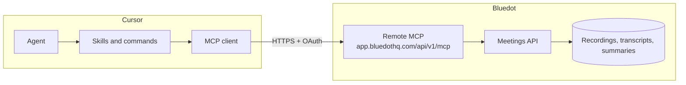

# Bluedot Cursor Plugin

[](https://modelcontextprotocol.io/)
[](LICENSE)

> **Your Bluedot recordings, in Cursor.** Search what was discussed, recap last week's calls, and turn decisions into plans and tickets.

A [Cursor](https://cursor.com) plugin that connects the agent to your Bluedot workspace over [MCP](https://modelcontextprotocol.io/). Ask about last week's calls, pull a feature plan from a discussion, or extract action items into Linear, Jira, Trello, and similar trackers.

This repo is a **Cursor plugin marketplace** (required for “add from folder”). The plugin lives in `plugins/bluedot`. It does **not** reimplement the MCP server — it points Cursor at Bluedot's remote MCP and adds skills and slash commands on top.

## Features

- **Meeting search** — Find recordings by title, description, or transcript text
- **Meeting details** — Summaries, topics, action items, participants, and canonical links
- **Transcript access** — Full conversations with speaker labels when the summary is not enough
- **Last-week digest** — What you were on last week, grouped by day
- **Feature plans** — Turn a discussion into an implementation plan, not a recap
- **Tickets from calls** — Propose tasks, then create only the ones you confirm in a connected tracker

## Architecture



The plugin ships three layers:

| Piece | What it is |
| --- | --- |
| MCP | Remote HTTP server at `https://app.bluedothq.com/api/v1/mcp` (OAuth via WorkOS) |
| Skills | How the agent should pick tools, handle transcripts, plan from calls, and turn recordings into tickets |
| Commands | `/bluedot-last-week`, `/bluedot-tasks` |

## Prerequisites

- [Cursor](https://cursor.com)
- A [Bluedot](https://www.bluedothq.com) account with access to the meetings you want to query
- (Optional) A ticket plugin — Linear, Jira, Trello, GitHub, Asana, or similar — if you want `/bluedot-tasks` to create issues instead of a copyable list

## Usage

Once installed and signed in, talk to the agent in plain language or use a slash command.

### Search and recap

- *“What did we decide about onboarding in last week's calls?”*
- *“Find meetings about the billing redesign”*
- *“Summarize yesterday's standup”*
- *“Who was on the product review with Alex?”*

### Last-week digest

- `/bluedot-last-week`
- *“What was I on last week?”*

You get a digest of the last 7 days of meetings **recorded with Bluedot** that you participated in, grouped by day, with your action items.

### Feature plans

- *“Plan the feature we discussed on the growth call”*
- *“What did we decide about billing v2, and how should we implement it?”*

You get an implementation plan (objective, assumptions, tasks, open questions) sourced from the matching recording — not a full recap. The agent does not start coding unless you ask.

### Tasks and tickets

- `/bluedot-tasks`
- `/bluedot-tasks Q3 planning`
- *“Create Linear tickets from yesterday's engineering sync”*

You first get a **proposed** ticket list (and what was skipped). Confirm with `all`, numbers (`1,3`), or `none`. Then:

| Trackers connected | What happens |
| --- | --- |
| One (e.g. Linear) | Confirmed tasks are created there |
| Several | You choose which tracker |
| None | You still get a copyable markdown list |

This plugin does **not** bundle Linear, Jira, Trello, or GitHub. Install those from Cursor Plugins (or another MCP) so the agent can create tickets.

## Slash commands

| Command | What it does |
| --- | --- |
| `/bluedot-last-week` | Digest of meetings recorded with Bluedot from the last 7 days where you were a participant |
| `/bluedot-tasks` | Tasks from a recording, then create the ones you pick in a connected tracker |

`/bluedot-tasks` accepts an optional meeting name, URL, or video id. With no argument, it uses the latest meeting you joined.

## Available tools

These are the Bluedot MCP tools the plugin exposes after OAuth:

| Tool | Description | Key parameters |
| --- | --- | --- |
| `get_current_user` | Who is signed in (id, email, name) | — |
| `list_workspaces` | Workspaces you belong to | — |
| `get_workspace` | Workspace members and roles | `workspaceId` |
| `list_collections` | Collections (groups of meetings) in a workspace | `workspaceId` (optional) |
| `list_meetings` | Recordings with filters, sort, and pagination | `uploadedFrom` / `uploadedTo`, `hasParticipantEmail`, `collectionId`, `pageSize` (max 16) |
| `search_meetings` | Search by text across title, description, and/or transcript | `query` (required), `searchBy`, `sortBy`, `workspaceId` |
| `get_meeting` | Full meeting: summary, participants, transcript | `videoId` |
| `list_participants` | Unique participant emails in a workspace | `workspaceId` (optional) |

The agent should search or list first, then call `get_meeting` only after it has an id. You can only access recordings your Bluedot account can already see.

## Troubleshooting

**Tools missing or auth error**

Complete OAuth: ask the agent to run `mcp_auth`, or approve the Bluedot prompt in Cursor. Then retry `get_current_user`.

**No meetings in last week's digest**

The digest only includes recordings from the last 7 days where **you** are a participant. Short test recordings and junk titles are skipped unless you ask for everything.

**Can't open a specific meeting**

MCP respects Bluedot permissions. If you can't see the recording in the Bluedot app, the agent can't either.

**Tickets were proposed but not created**

That is expected. Confirm which tasks to create. If no tracker plugin is installed, copy the list or install Linear / Jira / Trello / GitHub from Cursor Plugins.

## Smoke test

After reload and OAuth:

1. Ask the agent to call `get_current_user` and confirm it returns your Bluedot account.
2. Run `/bluedot-last-week`.
3. Ask for a plan of a feature you discussed on a call.
4. Run `/bluedot-tasks` (optionally with a meeting name). Confirm a subset only if you want tickets created.

## Development

This repo does not run a local MCP server. Skills and commands live under `plugins/bluedot`.

```text
.cursor-plugin/marketplace.json   # required for add-from-folder
plugins/bluedot/
  .cursor-plugin/plugin.json
  mcp.json
  skills/
    use-bluedot-meetings/
    last-week-digest/
    meeting-to-plan/
    meeting-to-tasks/   # + ticket-systems.md
  commands/
  logo.svg
```

Staging MCP is not part of this plugin. Keep a personal `~/.cursor/mcp.json` entry if you need `https://stage.app.bluedothq.com/api/v1/mcp`.

## License

This project is licensed under the MIT License — see [LICENSE](LICENSE).

## Support

- Product: [bluedothq.com](https://www.bluedothq.com)
- MCP help: [Bluedot MCP overview](https://help.bluedothq.com/en/articles/14708332-bluedot-mcp)
